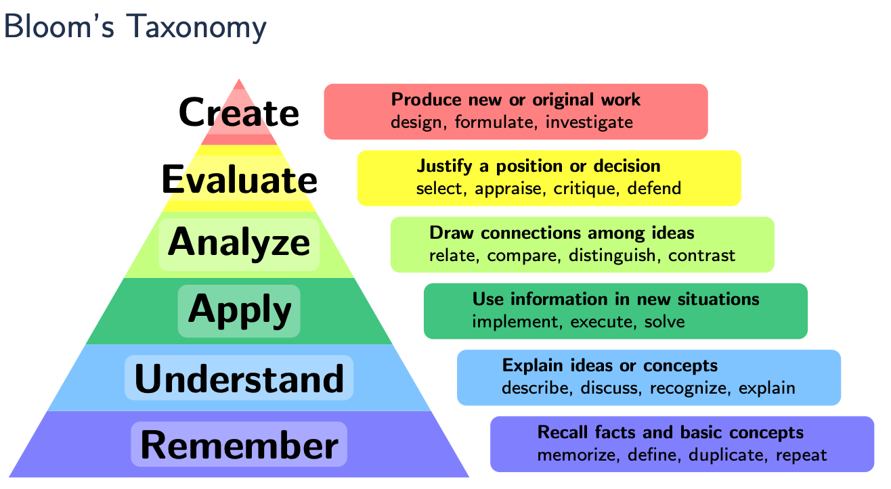
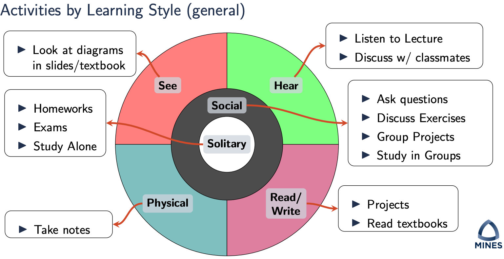

# 编译器特别兴趣小组-论文研讨班
## Motivation
> About how to Learn, pictures from [CSCI-561: Theory of Computation (Theory)](https://inside.mines.edu/~ndantam/csci-561/syllabus.pdf), [Lecture-0](https://inside.mines.edu/~ndantam/csci-561/L00-theory-intro-prelecture.pdf)
> 
> 

- 传统：
  - 发现做理论的同学，他们组里基本上都会有开研讨班这样的传统，大概就是大家一起来刷某本书，轮流领导讲课，然后共同解决课后习题。在国外许多PhD的研讨课上也是采用研讨的方法来研读论文。后来也在知乎上看到某位大佬自己组织数据库相关的研讨班。和小伙伴交流之后，发现好多人都有同样的兴趣和苦恼，所以大家决定一起组织起来这个研讨班，共同进步、共同提高。
  >
  > 吾尝终日而思矣，不如须臾之所学也；吾尝跂而望矣，不如登高之博见也...... 君子生非异也，善假于物也。
  > 
  > ——荀子，《劝学》
- 学习：
  - 选择了UIUC PhD编译器方向博士资格考试里的论文列表，这个列表多年稳定不变，可见其经典
  - 观察：阳光底下没有新鲜事，许多现在在做的东西，很早就有提出来，“文艺复兴”
    >
    > Those who cannot remember the past are condemned to repeat it.
    > 
    > ——George Santayana, The Life of Reason, 1905
  - 灵魂拷问：缩小到编译领域，那么那些经典的工作，你真的弄懂了吗？
- 学术上的进步需要多和人讨论
  - 大家一起讨论，能体会看待同一个问题的不同视角。同样一篇论文，学习一下别人会用什么样的方式来完成一个汇报
  - 通过回答别人的提问，能提高自己对问题理解的深度，发现自己阅读论文时没有注意到的问题
- 贵在坚持
  - 整个列表经典论文，通过自己精读、作报告或听别人作报告的方式学习完，也是一件很了不起的事情
- it's all about practice and training
  - you will gain:
    - 文献的阅读能力
    - 汇报展示工作的表达能力
    - 深度思考能力
  - 等到自己需要独立做研究的时候，经过了整个训练，参与的每一个同学都会有足够的能力来做科研

## Paper List
研讨班中的论文范围：[selected_paper.md](https://github.com/zihaoli-cn/compiler-paper-reading/blob/main/selected_paper.md)

阅读列表的主要来源：
- 主要来自于UIUC Compilers Track PhD Qualifying Exam [Old Version](http://rsim.cs.uiuc.edu/arch/compiler_qual.html), [New Version](https://wiki.illinois.edu/wiki/display/architecture/Compilers+Track)
- 选择了[Cornell CS 6120: Advanced Compilers](https://www.cs.cornell.edu/courses/cs6120/2020fa)中推荐阅读文章的几篇高引论文
- 成员推荐

## Schedule
- 已选择的paper见Issues，讲完一个会被标注为closed，在selected_paper中会有标注
- 每周要讲的论文及时间安排[schedule.md](https://github.com/zihaoli-cn/compiler-paper-reading/blob/main/schedule.md)

## Advice
- 带着有趣的问题来讨论，不要只是来听别人给你讲嚼过的的paper
